# ModelSnap.ai - Complete Project Documentation

**Version:** 1.0  
**Last Updated:** 2025-01-27  
**Status:** MVP Implementation

---

## Table of Contents

1. [Overview](#overview)
2. [Database Collection Schemas](#database-collection-schemas)
3. [User Flow Diagrams](#user-flow-diagrams)
4. [API Sequence Diagrams](#api-sequence-diagrams)
5. [System Architecture](#system-architecture)
6. [Frontend Component & Route Flow](#frontend-component--route-flow)
7. [Consent Logic State Machine](#consent-logic-state-machine)
8. [Credit Usage Flow](#credit-usage-flow)
9. [Tech Stack](#tech-stack)
10. [Theme & Design System](#theme--design-system)

---

## Overview

ModelSnap.ai is an AI-powered fashion photography platform designed specifically for Sri Lankan fashion brands. The platform enables businesses to upload clothing items and render them on AI-generated Sri Lankan models or human models with proper consent and royalty management.

### Key Features

- **AI Avatar Gallery**: 32 pre-generated Sri Lankan avatars (4 body types × 4 skin tones × 2 genders)
- **Human Model Marketplace**: Ethical consent workflow with one-time approval per business-model pair
- **Credit-Based System**: Pay-per-render with subscription plans
- **Royalty Management**: Automatic royalty tracking and payout for human models
- **Watermarking**: Free tier includes watermarked images
- **High-Resolution Downloads**: Premium tiers offer watermark-free downloads

### Core Principles

- **One-Time Consent**: A business must request consent once per model. After approval, unlimited use.
- **Server-Side Rendering**: All AI generation logic runs server-side for security
- **Type Safety**: Strict TypeScript with no `any` types
- **Component-Based**: Reusable, maintainable React components
- **Performance First**: Optimal use of Next.js Server Components

---

## Database Collection Schemas

### 📌 **users**

| Field Name | Data Type | Key Type | Indexing | Description |
|-----------|-----------|----------|----------|-------------|
| _id | ObjectId | Primary Key | Default | Unique ID for the user document. |
| id | String | Unique | Indexed | **Clerk user ID** (primary identifier). This is the Clerk authentication ID used throughout the codebase. |
| emailAddress | Array<String> |  | Indexed | User's email addresses from Clerk. |
| firstName | String |  |  | User's first name. |
| lastName | String |  |  | User's last name. |
| picture | String |  |  | Profile picture URL from Clerk. |
| role | String |  | Indexed | User role: `'BUSINESS'`, `'MODEL'`, or `'ADMIN'`. Default: `'BUSINESS'`. |
| stripeCustomerId | String |  | Indexed | Stripe customer ID for payment processing. |
| lemonsqueezyCustomerId | String |  |  | Lemon Squeezy customer ID (alternative payment). |
| webxpayCustomerId | String |  |  | WebXPay customer ID (alternative payment). |
| credits | Number |  |  | Remaining AI photo credits. **CRITICAL**. Default: 10 (free tier). |
| plan | Object (Embedded) |  |  | Current subscription plan details. |
| plan.id | String |  |  | Plan identifier (e.g., "free", "starter", "growth"). |
| plan.type | String |  |  | Plan type: "free" or subscription type. |
| plan.planType | String |  |  | Legacy field - kept for backward compatibility. |
| plan.name | String |  |  | Display name of the plan. |
| plan.price | String |  |  | Plan price as string. |
| plan.isPremium | Boolean |  |  | Whether plan includes premium features. |
| createdAt | Date |  |  | Timestamp of creation. |
| updatedAt | Date |  |  | Timestamp of last update. |

**Current Implementation:** `models/user.ts`  
**Notes:**
- The `id` field stores the Clerk user ID (not a separate `clerkId` field)
- A virtual `clerkId` is available for backward compatibility (returns `id`)
- Role field added for future role-based access control (BUSINESS, MODEL, ADMIN)
- All critical fields are indexed for performance

---

### 📌 **business_profiles**

| Field Name | Data Type | Key Type | Indexing | Description |
|-----------|-----------|----------|----------|-------------|
| _id | ObjectId | Primary Key | Default | Unique profile ID. |
| userId | ObjectId | Foreign Key | Unique | Links to user in **users** collection. |
| businessName | String |  |  | Name of the boutique/company. |
| aiCredits | Number |  |  | Remaining AI photo credits. **CRITICAL**. |
| subscriptionStatus | String |  | Single | `'STARTER'`, `'GROWTH'`, `'FREE'`, etc. |
| approvedModels | Array<ObjectId> | Foreign Key |  | Whitelist of Human Model IDs (refs `model_profiles._id`). |
| stripeCustomerId | String |  | Single | Stripe customer ID. |
| packageId | ObjectId | Foreign Key |  | Ref to **packages** collection. |
| createdAt | Date |  |  | Timestamp of creation. |
| updatedAt | Date |  |  | Timestamp of last update. |

**Status:** TODO - Model needs to be created  
**File:** `models/business-profile.ts`

---

### 📌 **model_profiles**

| Field Name | Data Type | Key Type | Indexing | Description |
|-----------|-----------|----------|----------|-------------|
| _id | ObjectId | Primary Key | Default | Unique model profile ID. |
| userId | ObjectId | Foreign Key | Unique | Links to user in **users** collection. |
| name | String |  |  | Public display name. |
| royaltyBalance | Number |  |  | Accumulated earnings. **CRITICAL**. Default: 0. |
| referenceImages | Array<String> (S3 URLs) |  |  | 3–4 likeness reference images stored in S3. |
| approvedBusinesses | Array<ObjectId> | Foreign Key |  | Allowed business IDs (refs `business_profiles.userId`). |
| consentSigned | Boolean |  |  | Confirms digital likeness release. Default: false. |
| status | String |  | Single | `'active'`, `'paused'`, `'inactive'`. |
| createdAt | Date |  |  | Timestamp of creation. |
| updatedAt | Date |  |  | Timestamp of last update. |

**Status:** TODO - Model needs to be created  
**File:** `models/model-profile.ts`

---

### 📌 **consent_requests**

| Field Name | Data Type | Key Type | Indexing | Description |
|-----------|-----------|----------|----------|-------------|
| _id | ObjectId | Primary Key | Default | Unique request ID. |
| businessId | ObjectId | Foreign Key | Compound | Business requesting consent (refs `business_profiles._id`). |
| modelId | ObjectId | Foreign Key | Compound | Model being asked (refs `model_profiles._id`). |
| status | String |  | Compound | `'PENDING'`, `'APPROVED'`, `'REJECTED'`, `'EXPIRED'`. |
| requestedAt | Date |  | Single | Created timestamp. |
| expiresAt | Date |  |  | Optional expiration date for consent. |
| grantedAt | Date |  |  | Timestamp when consent was approved. |
| rejectedAt | Date |  |  | Timestamp when consent was rejected. |
| **Combined Index** | N/A |  | Compound Index | `(businessId, modelId)` for quick lookup. |

**Status:** TODO - Model needs to be created  
**File:** `models/consent-request.ts`  
**Critical Rule:** One-time consent per business-model pair. Once approved, business can use model indefinitely.

---

### 📌 **generations**

| Field Name | Data Type | Key Type | Indexing | Description |
|-----------|-----------|----------|----------|-------------|
| _id | ObjectId | Primary Key | Default | Unique generation ID. |
| userId | ObjectId | Foreign Key | Compound | Business user (refs `users._id`). |
| modelId | ObjectId | Foreign Key | Compound | Human model used (refs `model_profiles._id`) or `null` for AI avatar. |
| avatarId | ObjectId | Foreign Key |  | AI avatar used (refs `ai_avatars._id`) or `null` for human model. |
| modelType | String |  |  | `'AI_AVATAR'` or `'HUMAN_MODEL'`. |
| garmentImageUrl | String |  |  | S3 URL of uploaded garment image. |
| outputS3Url | String |  |  | Final generated image S3 URL. |
| royaltyPaid | Number |  |  | `$2.00` if human model, `$0` otherwise. |
| creditsUsed | Number |  |  | Credits consumed (1 for AI avatar, 0 for human model). |
| status | String |  |  | `'pending'`, `'processing'`, `'completed'`, `'failed'`. |
| fashnRequestId | String |  |  | FASHN API request ID for tracking. |
| errorMessage | String |  |  | Error message if generation failed. |
| generatedAt | Date |  | Compound | Timestamp. |
| **Index** | N/A |  | Compound Index | `(userId, generatedAt)` — history lookup. |
| **Index** | N/A |  | Compound Index | `(modelId, generatedAt)` — royalty tracking. |

**Status:** Partially Done - Currently using `models/render.ts`  
**Note:** The Render model should be enhanced or replaced with Generation model to align with full schema.

---

### 📌 **packages**

| Field Name | Data Type | Key Type | Indexing | Description |
|-----------|-----------|----------|----------|-------------|
| _id | ObjectId | Primary Key | Default | Unique package ID. |
| stripePriceId | String |  | Unique | Direct Stripe pricing object link. **CRITICAL**. |
| lemonsqueezyVariantId | String |  | Unique | Lemon Squeezy variant ID (alternative). |
| name | String |  |  | E.g., `'STARTER TIER'`, `'GROWTH TIER'`. |
| description | String |  |  | Package description. |
| aiCreditsGranted | Number |  |  | Credits per purchase/subscription period. |
| humanModelAccess | Boolean |  |  | Enables Human Model marketplace access. |
| price | Number |  |  | Package price in USD. |
| currency | String |  |  | Currency code (e.g., "usd", "lkr"). |
| billingCycle | String |  |  | `'monthly'`, `'yearly'`, or `'one-time'`. |
| isActive | Boolean |  | Single | Display/hide package. Default: true. |
| createdAt | Date |  |  | Timestamp of creation. |
| updatedAt | Date |  |  | Timestamp of last update. |

**Status:** TODO - Model needs to be created  
**File:** `models/package.ts`

---

### 📌 **ai_avatars**

| Field Name | Data Type | Key Type | Indexing | Description |
|-----------|-----------|----------|----------|-------------|
| _id | ObjectId | Primary Key | Default | Unique AI avatar ID. |
| id | String | Unique | Unique | Custom unique identifier. |
| name | String |  |  | Display name (e.g., *AI Model Sophia*). |
| gender | String |  | Compound | `'male'` or `'female'`. |
| bodyType | String |  | Compound | Body type identifier (e.g., `'slim'`, `'medium'`, `'plus-size'`). |
| skinTone | String |  | Compound | Skin tone identifier (e.g., `'SL-01'`, `'SL-02'`). |
| imageUrl | String |  |  | Path relative to public folder or S3 URL. |
| s3Url | String |  |  | Canonical reference image in S3 (if stored in S3). |
| modelId | String |  |  | FASHN model ID if available. |
| isActive | Boolean |  | Single | Show/hide avatar. Default: true. |
| createdAt | Date |  |  | Timestamp of creation. |
| updatedAt | Date |  |  | Timestamp of last update. |

**Status:** Done - `models/avatar.ts`  
**Note:** Current implementation includes gender, bodyType, and skinTone for filtering.

---

### 📌 **invoices**

| Field Name | Data Type | Key Type | Indexing | Description |
|-----------|-----------|----------|----------|-------------|
| _id | ObjectId | Primary Key | Default | Unique invoice ID. |
| userId | ObjectId | Foreign Key | Single | Business owner (refs `users._id`). |
| businessId | ObjectId | Foreign Key |  | Business profile (refs `business_profiles._id`). |
| stripeInvoiceId | String |  | Unique | Stripe invoice ID (e.g., `in_...`). |
| invoiceNumber | String |  | Single | Human-readable invoice number. |
| amountDue | Number |  |  | Final payable amount. |
| currency | String |  |  | e.g., `'USD'`, `'LKR'`. |
| status | String |  | Single | `'draft'`, `'open'`, `'paid'`, `'uncollectible'`, `'void'`. |
| pdfUrl | String |  |  | Stripe-hosted PDF. **CRITICAL**. |
| hostedInvoiceUrl | String |  |  | Stripe-hosted invoice page. |
| periodStart | Date |  |  | Start of billing cycle. |
| periodEnd | Date |  |  | End of billing cycle. |
| lineItems | Array (Embedded) |  |  | Optional snapshot of line items. |
| paidAt | Date \| null |  |  | When payment was confirmed. |
| createdAt | Date |  |  | Timestamp of creation. |
| updatedAt | Date |  |  | Timestamp of last update. |

**Status:** TODO - Model needs to be created  
**File:** `models/invoice.ts`

---

## User Flow Diagrams

### 🧩 Business User Flow

#### 1. Signup & Setup

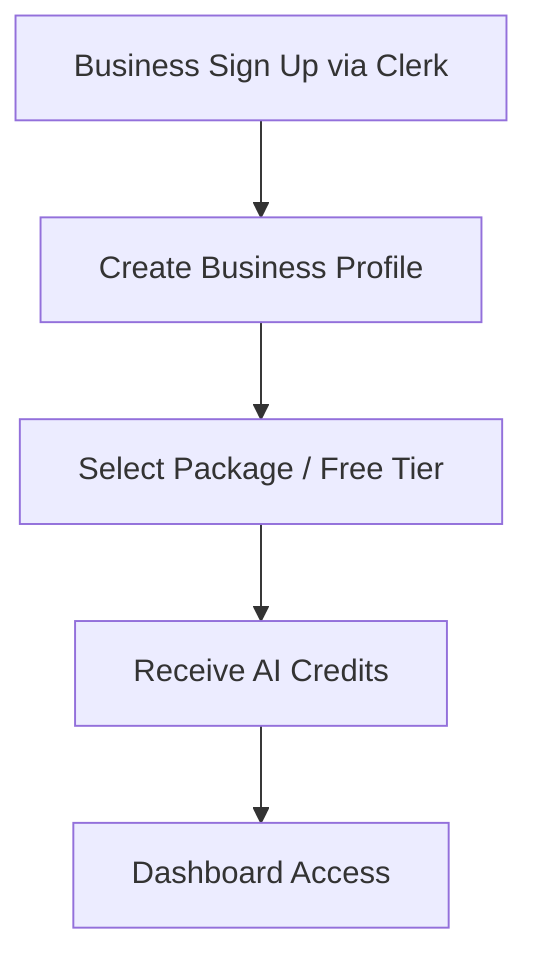

#### 2. Choose Image Creation Path

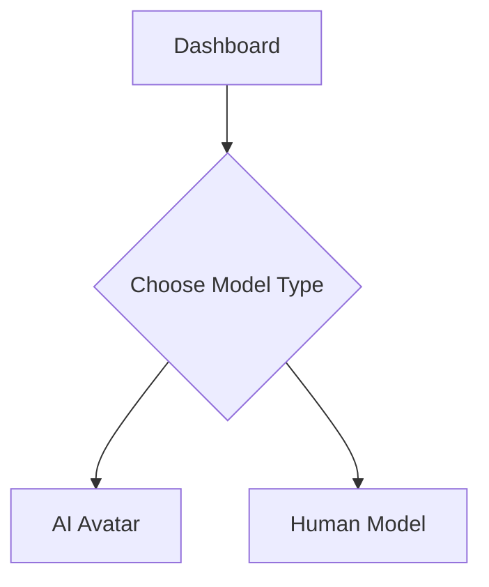

#### 3A. AI Avatar Workflow

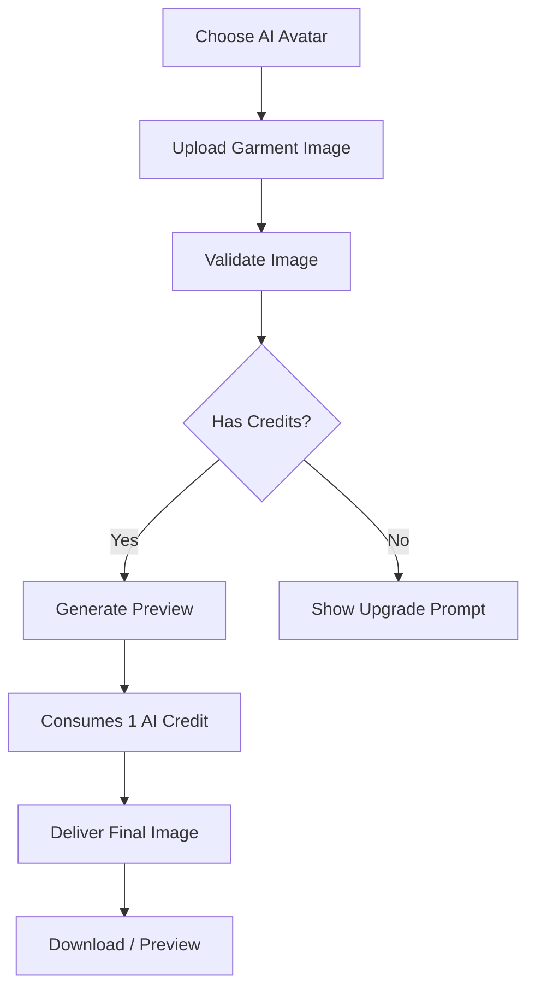

#### 3B. Human Model Workflow

##### Step 1 — Model Browsing

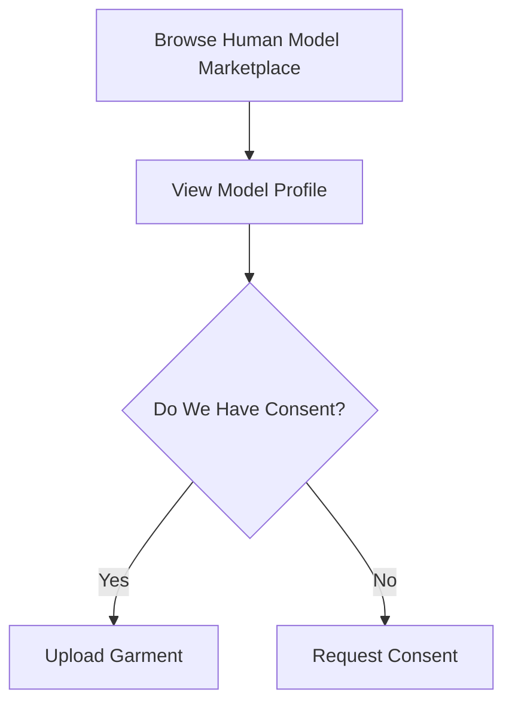

##### Step 2 — Consent Request

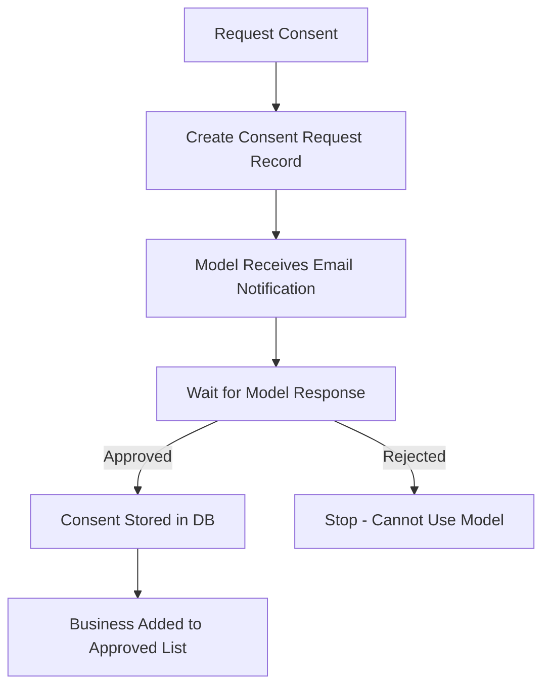

##### Step 3 — Post-Consent Flow

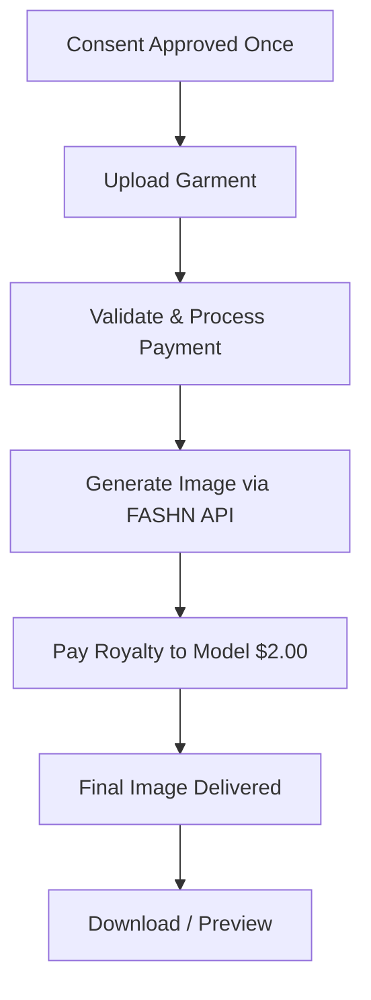

> **Critical Rule:** Consent is one-time per business per model. After approval, the business can continue using the model without asking again.

---

### 🧩 Model User Flow

#### 1. Signup & Profile Creation

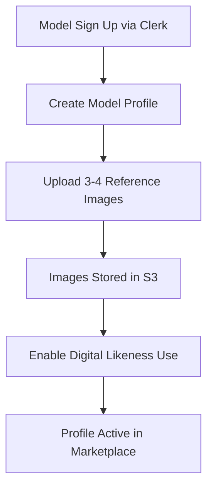

#### 2. Receiving Consent Requests

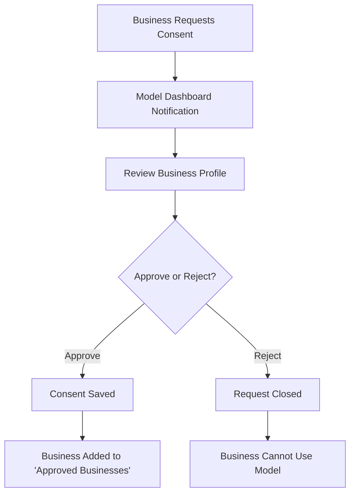

#### 3. Human Model Usage → Earning Royalties

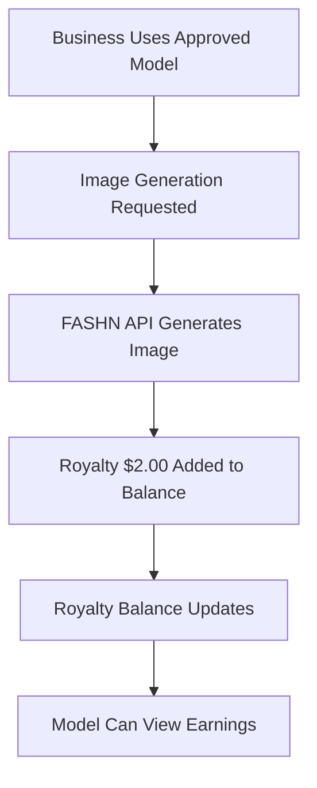

#### 4. Payout Flow

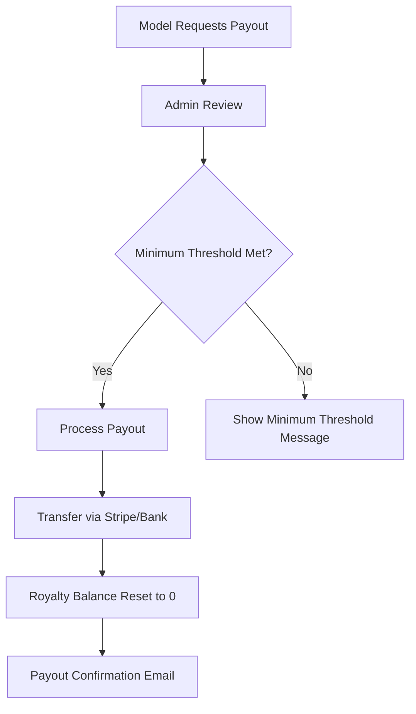

---

## API Sequence Diagrams

### Complete Generation Flow (AI Avatar)

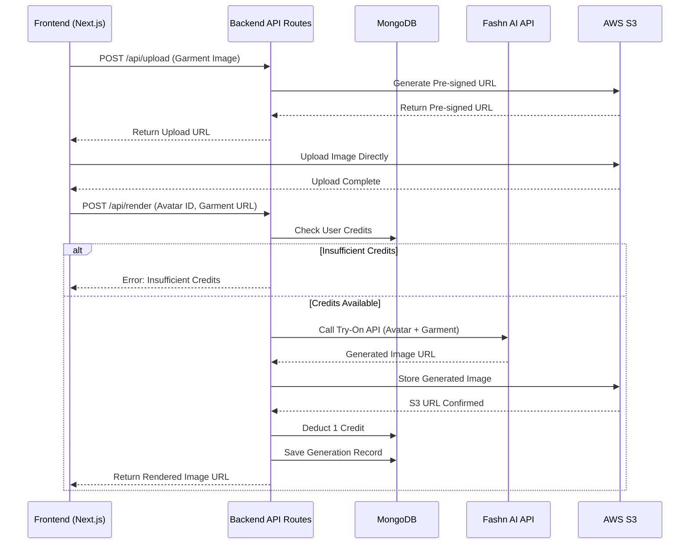

### Human Model Generation Flow

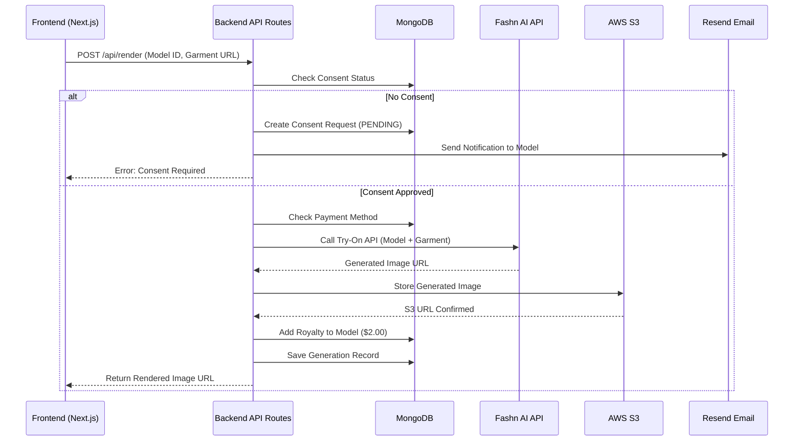

### Consent Request Flow

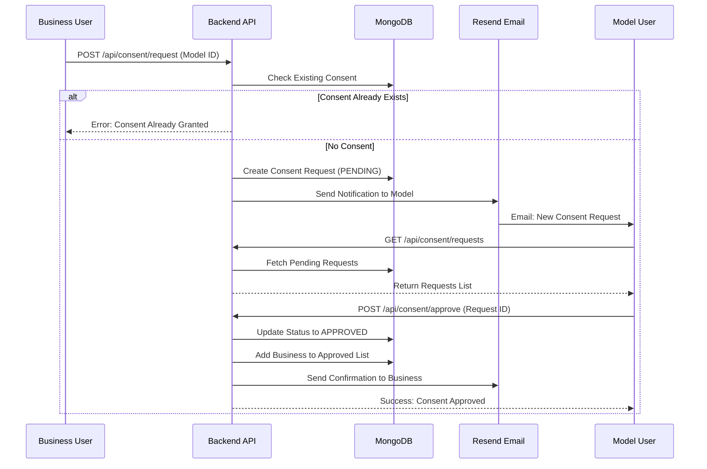

---

## System Architecture

### High-Level Architecture

```mermaid
flowchart TD
    %% Tiers Definition
    subgraph Client_Tier_1 [1. Client Tier - Browser/User]
        A[Business Owner / Model]
    end

    subgraph Edge_Application_Tier_2 [2. Edge / Application Tier - Next.js 15, Vercel]
        B[Next.js Server Components]
        C[Next.js Server Actions - Mutation]
        D[Next.js Middleware]
        E[Next.js Route Handlers - Webhooks]
    end

    subgraph Data_Storage_Tier_3 [3. Data & Storage Tier]
        F[AWS S3 - Image Storage]
        G[MongoDB - Data, Credits, Consent, Usage Logs]
    end

    subgraph External_Services_Tier_4 [4. External Services Tier - APIs]
        H[Clerk - Auth & User Management]
        I[Fashn AI - Virtual Try-On API]
        J[Stripe - Payments, Subscriptions]
        K[Resend - Email/Notifications]
        L[Google Analytics - Tag Manager]
        M[Grafana - Vercel Logs]
    end

    %% Flow Connections

    %% Authentication & Edge
    A -- Authenticates --> D
    D -- Auth Check --> H
    H -- User Data Sync --> G

    %% Data Fetching & UI (Fast Path)
    B -- Fetch (RSC) --> G
    B -- Fetch (RSC) --> F

    %% 1. Image Upload Flow (Secure & Efficient)
    A -- Initiate Upload --> C
    C -- 1. Generate Pre-signed URL --> F
    A -- 2. Upload Image Directly --> F
    C -- 3. Save S3 URL --> G

    %% 2. The Core AI Generation Flow (Secure)
    A -- Initiate Generation --> C
    C -- 1. Check Credits/Consent (G) & Fetch Inputs (F) --> G & F
    C -- 2. Call AI API (Secure) --> I
    I -- 3. Generates Image --> F
    C -- 4. Update Credit/Usage Log --> G
    C -- 5. Returns Generated S3 URL --> A

    %% 3. Payment & Subscription Flow (Secure)
    A -- Checkout / Upgrade --> C
    C -- 1. Create Checkout Session --> J
    J -- 2. Redirects User --> A
    J -- 3. Payment Confirmed (Webhook) --> E
    E -- 4. Update Credits/Subscription --> G

    %% 4. Human Model Consent Flow (Gated)
    A -- Send Consent Request --> C
    C -- 1. Create 'PENDING' record --> G
    C -- 2. Notify Model - via Email --> K
    A -- Model Responds/Approve --> C
    C -- 3. Update Status / Whitelist --> G

    %% Monitoring & Tracking
    D -- Logs Events --> M
    D -- Client Scripts --> L
```

### Component Architecture

```mermaid
flowchart TB
    subgraph NextJS_App [Next.js 15 App Router]
        subgraph Server_Components [Server Components - Default]
            SC1[Landing Page Sections]
            SC2[Avatar Gallery]
            SC3[Render History]
            SC4[Admin Dashboard]
        end
        
        subgraph Client_Components [Client Components - Interactive]
            CC1[Upload Interface]
            CC2[Avatar Selector]
            CC3[Render Interface]
            CC4[Theme Toggle]
            CC5[Credit Counter]
        end
        
        subgraph Server_Actions [Server Actions - Mutations]
            SA1[Render Generation]
            SA2[Credit Deduction]
            SA3[Consent Request]
            SA4[Payment Processing]
        end
        
        subgraph API_Routes [API Routes - External]
            API1[/api/render]
            API2[/api/upload]
            API3[/api/consent]
            API4[/api/webhook/stripe]
        end
    end
    
    Server_Components --> Client_Components
    Client_Components --> Server_Actions
    Server_Actions --> API_Routes
    API_Routes --> External[External Services]
```

---

## Frontend Component & Route Flow

### Landing Page Structure

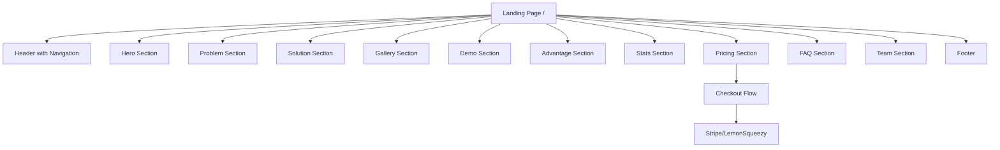

### Business Dashboard Routes

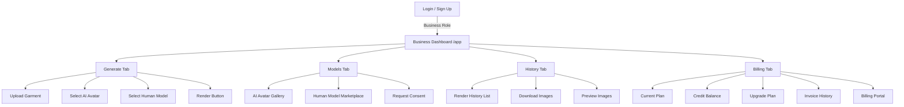

### Model Dashboard Routes

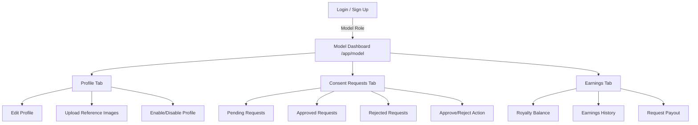

### Navigation Structure

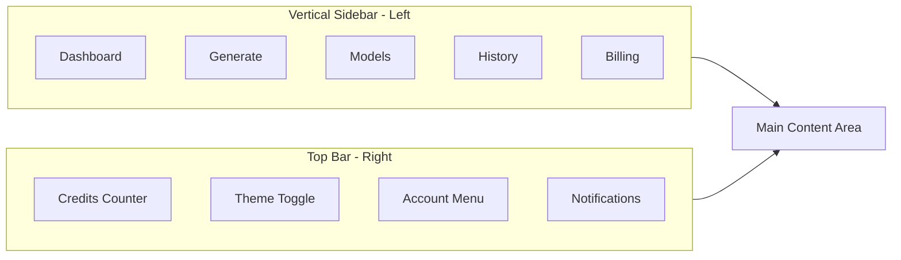

**Navigation Pattern:** Hybrid Navigation
- **Vertical Sidebar (Left)**: Primary navigation between major sections
- **Top Bar**: User profile, credits counter, notifications, role switcher
- **Mobile**: Collapsible hamburger menu

---

## Consent Logic State Machine

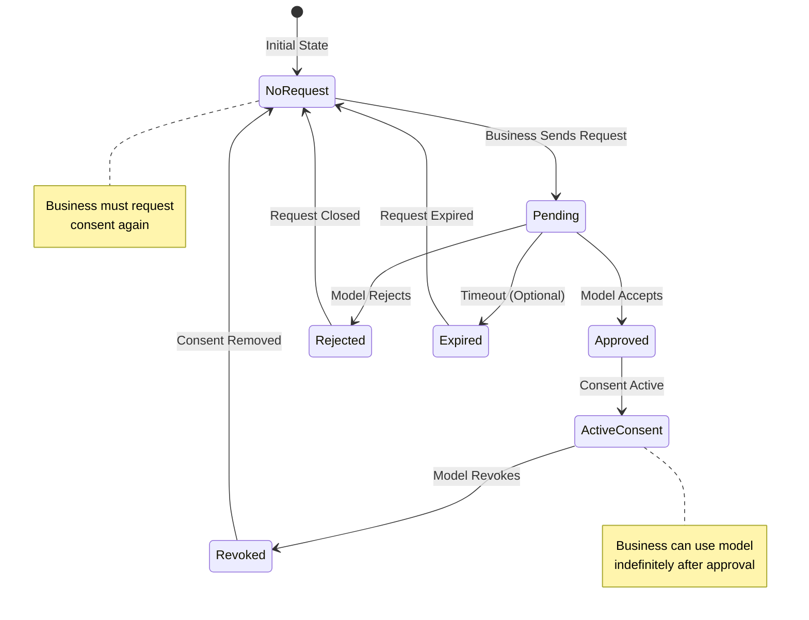

### Consent States

- **NoRequest**: No consent request exists
- **Pending**: Request sent, awaiting model response
- **Approved**: Model approved, consent active
- **Rejected**: Model rejected the request
- **Expired**: Request expired (if time-limited)
- **ActiveConsent**: Consent is active and usable
- **Revoked**: Model revoked previously approved consent

---

## Credit Usage Flow

### AI Avatar Credit Flow

```mermaid
flowchart TD
    A[User Initiates Generation] --> B{Model Type?}
    B -->|AI Avatar| C[Check AI Credits]
    C --> D{Credits >= 1?}
    D -->|Yes| E[Validate Garment Image]
    D -->|No| F[Show Upgrade Prompt]
    F --> G[Redirect to Billing]
    E --> H[Call FASHN API]
    H --> I[Receive Generated Image]
    I --> J[Deduct 1 Credit]
    J --> K[Save Generation Record]
    K --> L[Store Image in S3]
    L --> M[Return Image URL]
    M --> N{Free Plan?}
    N -->|Yes| O[Apply Watermark]
    N -->|No| P[Return Clean Image]
    O --> Q[Display Preview]
    P --> Q
    Q --> R[Download Available]
```

### Human Model Credit Flow

```mermaid
flowchart TD
    A[User Initiates Generation] --> B{Model Type?}
    B -->|Human Model| C[Check Consent Status]
    C --> D{Consent Approved?}
    D -->|No| E[Create Consent Request]
    E --> F[Send Email to Model]
    F --> G[Wait for Approval]
    D -->|Yes| H[Process Payment $2.00]
    H --> I[Call FASHN API]
    I --> J[Receive Generated Image]
    J --> K[Add Royalty to Model]
    K --> L[Save Generation Record]
    L --> M[Store Image in S3]
    M --> N[Return Image URL]
    N --> O[Display Preview]
    O --> P[Download Available]
```

### Combined Credit Flow Diagram

```mermaid
flowchart LR
    A[Generation Request] --> B{AI or Human Model?}

    B -->|AI Avatar| C[Check AI Credits]
    C -->|Credits Available| D[Generate]
    C -->|No Credits| E[Show Upgrade]

    B -->|Human Model| F[Check Consent]
    F -->|No Consent| G[Send Consent Request]
    F -->|Consent Approved| H[Charge $2.00]
    H --> D[Generate]

    D --> I[Store in S3]
    D --> J[Log in DB]
    J --> K[Return to User]
```

---

## Tech Stack

### Frontend
- **Framework**: Next.js 15 (App Router)
- **Language**: TypeScript (strict mode)
- **Styling**: Tailwind CSS 4
- **UI Components**: Radix UI primitives
- **Animations**: Framer Motion
- **State Management**: React Context API
- **Internationalization**: next-intl

### Backend
- **Runtime**: Node.js
- **API**: Next.js API Routes & Server Actions
- **Database**: MongoDB with Mongoose ODM
- **File Storage**: AWS S3
- **Authentication**: Clerk
- **Payments**: Stripe, Lemon Squeezy, WebXPay
- **Email**: Resend

### External Services
- **AI Generation**: Fashn.ai Virtual Try-On API
- **Analytics**: Google Analytics
- **Logging**: Grafana (Vercel Logs)
- **Deployment**: Vercel

### Development Tools
- **Testing**: Playwright
- **Linting**: ESLint
- **Type Checking**: TypeScript
- **CI/CD**: GitHub Actions

---

## Theme & Design System

### Color Palette

#### Light Mode
- **Primary**: `#015064` (Teal/Cyan) - Main brand color
- **Accent**: `#027d94` (Brighter teal)
- **Background**: `#F7F7F7` (Light gray)
- **Foreground**: `#1A1A1A` (Dark gray)
- **Muted**: `#f8fafc` (Very light gray)
- **Border**: `#e2e8f0` (Light border)

#### Dark Mode
- **Primary**: `#03a9c6` (Brighter teal for visibility)
- **Accent**: `#027d94`
- **Background**: `#121314` (Dark background)
- **Foreground**: `#f8fafc` (Light text)
- **Muted**: `#334155` (Dark muted)
- **Border**: `#334155` (Dark border)

### Typography
- **Headings**: Inter (font-sans)
- **Body**: IBM Plex Sans (alternative)
- **Accent**: Sora/Mulish (optional)

### Spacing & Layout
- **Border Radius**: `0.75rem` (12px) base
- **Container Max Width**: `screen-xl` (1280px)
- **Sidebar Width**: Collapsible, default open
- **Top Bar Height**: `55px`

### Component Patterns
- **Cards**: Rounded corners, subtle shadows
- **Buttons**: Primary, secondary, ghost variants
- **Forms**: Clean inputs with focus rings
- **Modals**: Backdrop blur, centered content

---

## Security & Performance

### Security Measures
- **Server-Side Rendering**: All AI generation logic runs server-side
- **Rate Limiting**: Implemented on API routes
- **Authentication**: Clerk handles all auth flows
- **File Upload**: Pre-signed S3 URLs for direct upload
- **API Keys**: Stored in environment variables, never exposed

### Performance Optimizations
- **Server Components**: Default for data fetching
- **Client Components**: Only for interactivity (upload, animations)
- **Image Optimization**: Next.js Image component with S3
- **Caching**: MongoDB queries cached where appropriate
- **Code Splitting**: Automatic with Next.js App Router

### Scalability Considerations
- **Database Indexing**: Compound indexes on frequently queried fields
- **S3 Storage**: Scalable object storage
- **API Rate Limits**: Monitored and enforced
- **Error Handling**: Comprehensive error boundaries
- **Logging**: Centralized logging via Grafana

---

## API Endpoints

### Render Endpoints
- `POST /api/render` - Generate AI avatar or human model image
- `GET /api/render/history` - Get user's render history

### Upload Endpoints
- `POST /api/upload` - Get pre-signed S3 URL for upload

### Avatar Endpoints
- `GET /api/avatars` - List all available AI avatars

### Consent Endpoints (TODO)
- `POST /api/consent/request` - Request consent from model
- `GET /api/consent/requests` - Get consent requests (for models)
- `POST /api/consent/approve` - Approve consent request
- `POST /api/consent/reject` - Reject consent request

### Payment Endpoints
- `POST /api/payments/checkout` - Create checkout session
- `POST /api/webhook/stripe` - Handle Stripe webhooks
- `GET /api/payment-status` - Check payment status

### Admin Endpoints
- `GET /api/admin/users` - List all users
- `PUT /api/admin/users/:id` - Update user (credits, plan)

---

## Environment Variables

### Required Variables
```env
# Database
MONGO_URI=mongodb://...
MONGODB_DATABASE=modelsnap

# Authentication
NEXT_PUBLIC_CLERK_PUBLISHABLE_KEY=pk_...
CLERK_SECRET_KEY=sk_...
CLERK_WEBHOOK_SIGNING_SECRET=whsec_...

# AI API
FASHN_API_KEY=your_fashn_api_key

# Payments
STRIPE_SECRET_KEY=sk_...
NEXT_PUBLIC_STRIPE_PUBLISHABLE_KEY=pk_...
STRIPE_WEBHOOK_SECRET=whsec_...

# Email
RESEND_API_KEY=re_...

# Admin
ADMIN_EMAILS=admin@example.com

# Optional
NEXT_PUBLIC_GOOGLE_ANALYTICS_ID=G-...
```

---

## Development Guidelines

### Code Standards
- **TypeScript**: Strict mode, no `any` types
- **Components**: Server components by default
- **Client Components**: Only for upload UI, animations, forms
- **Naming**: PascalCase for components, camelCase for functions
- **File Structure**: Follow Next.js App Router conventions

### Testing Requirements
- **Component Tests**: Playwright for all UI components
- **Integration Tests**: Full user flows
- **E2E Tests**: Critical paths (signup, render, payment)

### Git Workflow
- **Branching**: Feature branches from main
- **Commits**: Descriptive commit messages
- **PRs**: Required before merging
- **CI/CD**: Automatic on push to main

---

## Future Enhancements

### Phase 2
- Background presets
- Batch upload
- Brand kits
- Advanced filtering

### Phase 3
- Pose packs
- Custom avatars
- API access for developers
- White-label options

### Phase 4
- International expansion
- Multi-language support
- Additional payment methods
- Mobile app

---

**End of Documentation**

