# ModelSnap.ai - Complete Data Flow Diagram

**Last Updated:** January 18, 2026

This document provides detailed data flow diagrams for all major processes in the ModelSnap.ai platform.

---

## 1. Complete Image Generation Flow (AI Avatar)

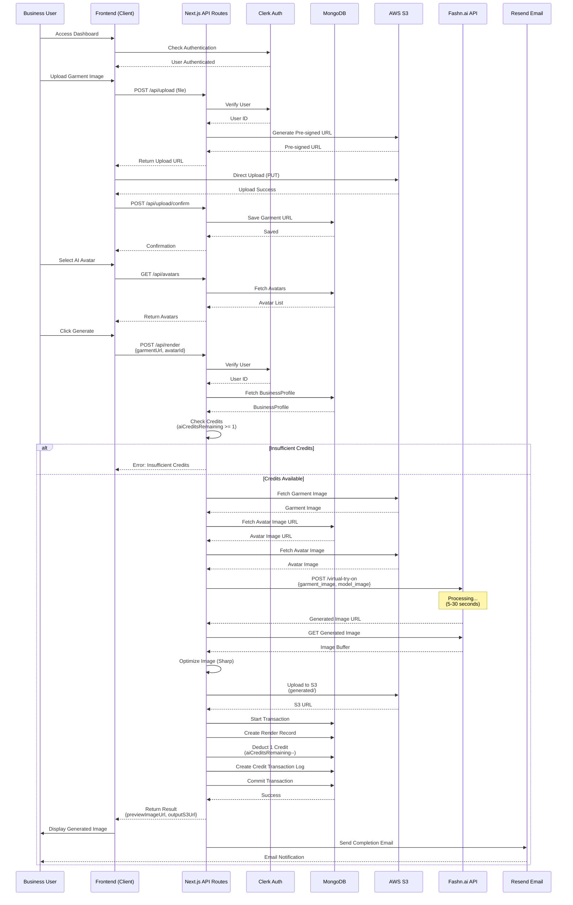

---

## 2. Complete Image Generation Flow (Human Model)

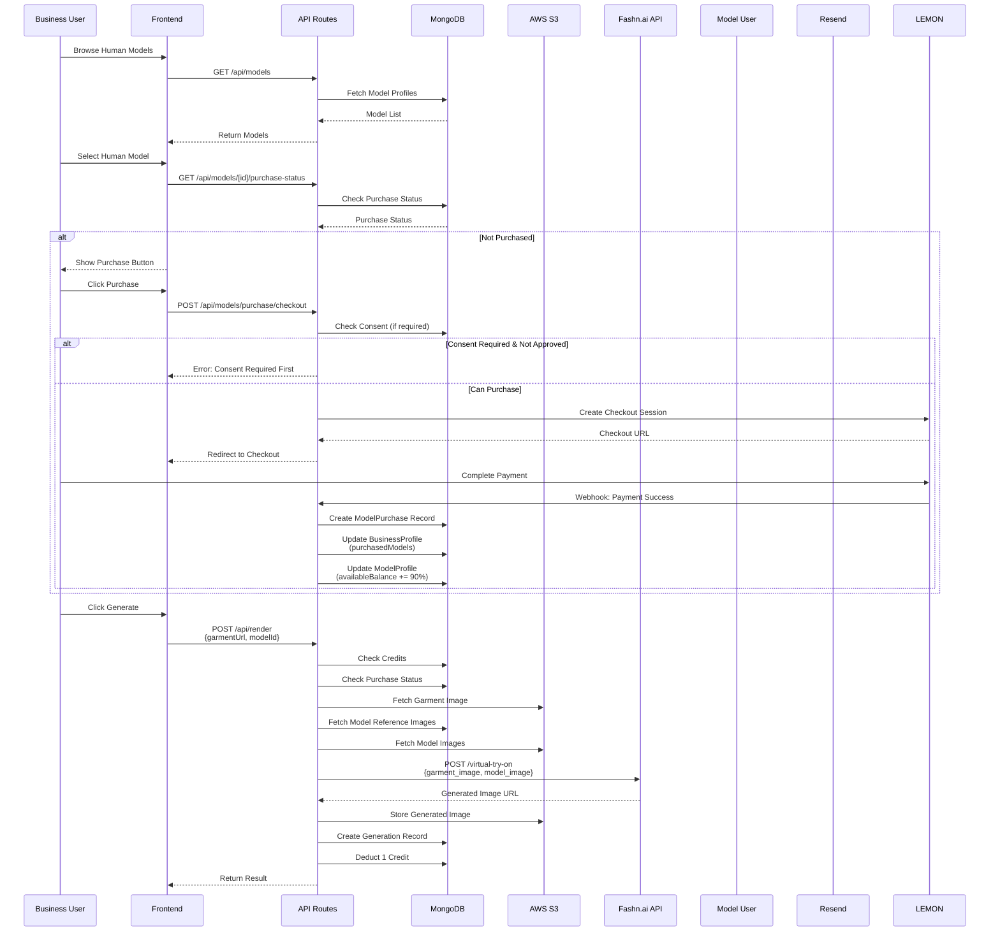

---

## 3. Payment & Subscription Flow (Lemon Squeezy)

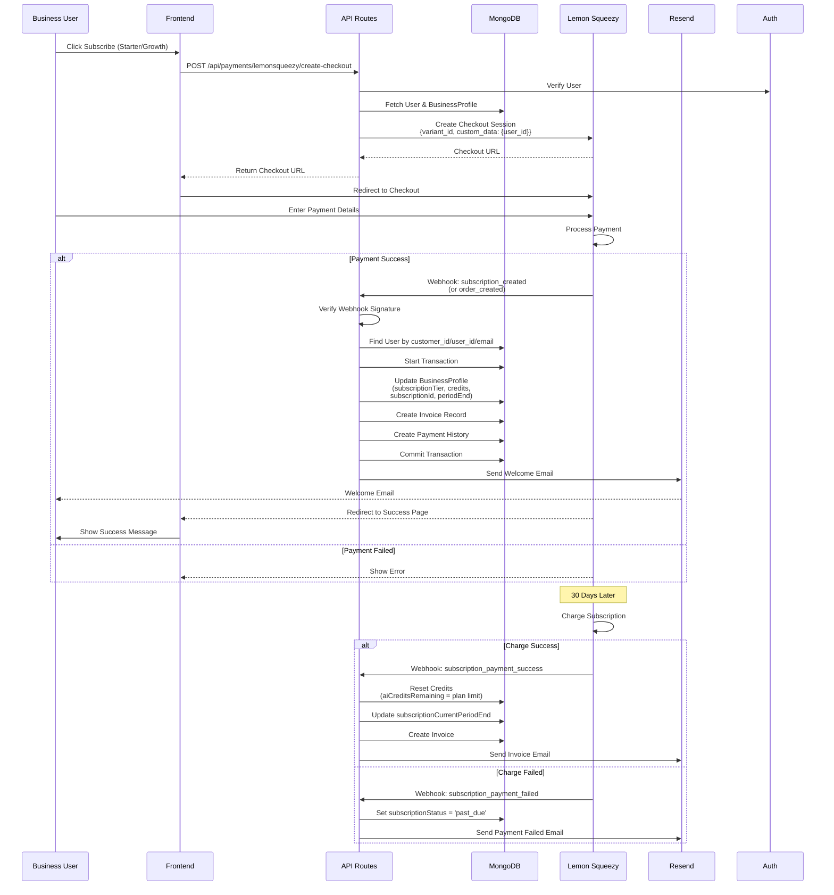

---

## 4. Consent Request Flow

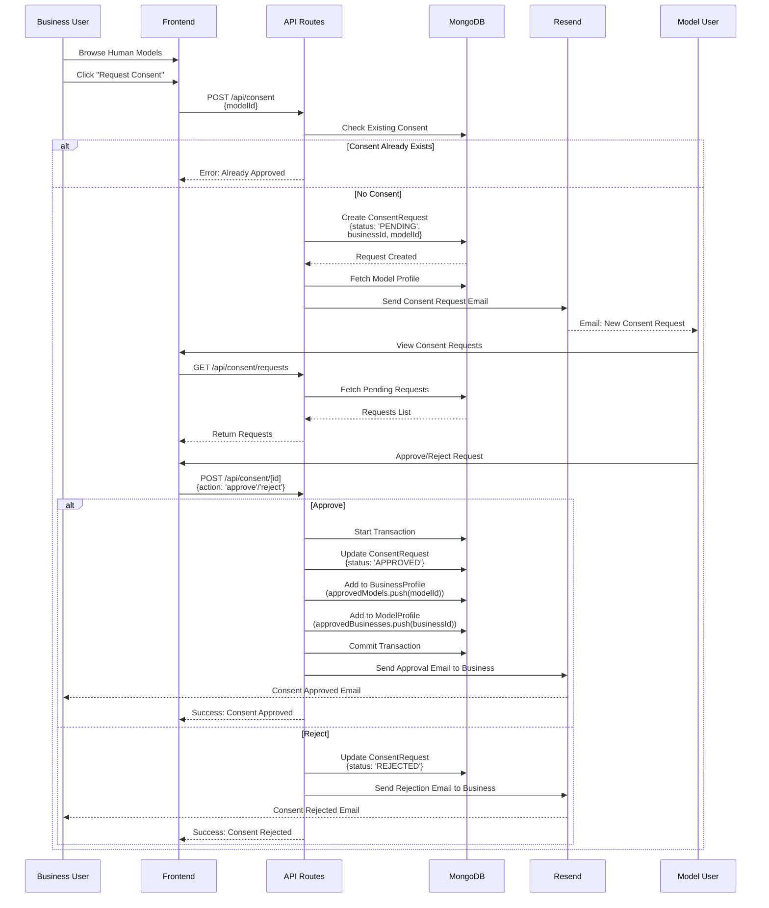

---

## 5. Model Purchase Flow

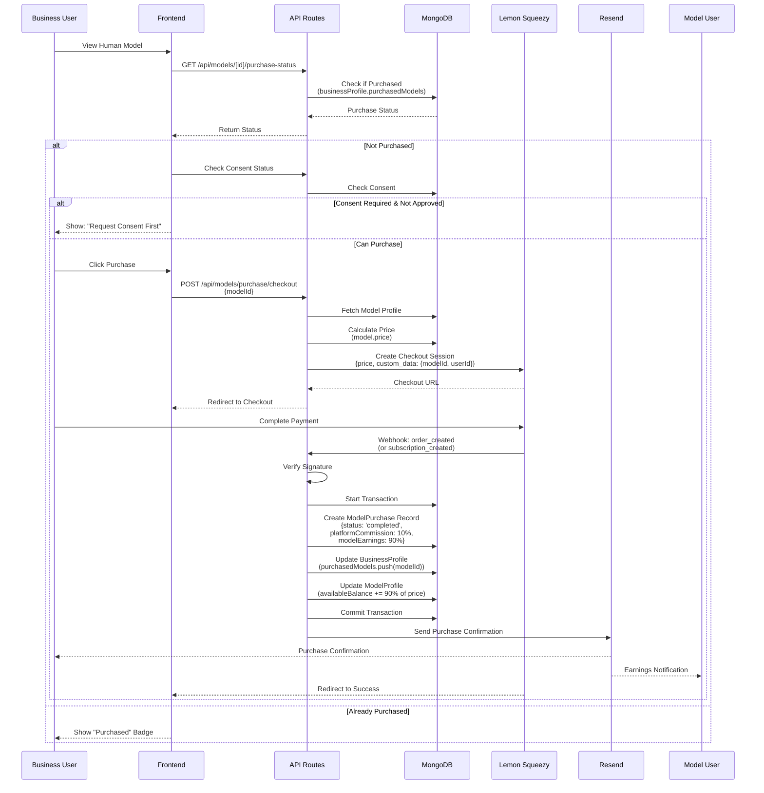

---

## 6. Credit Management Flow

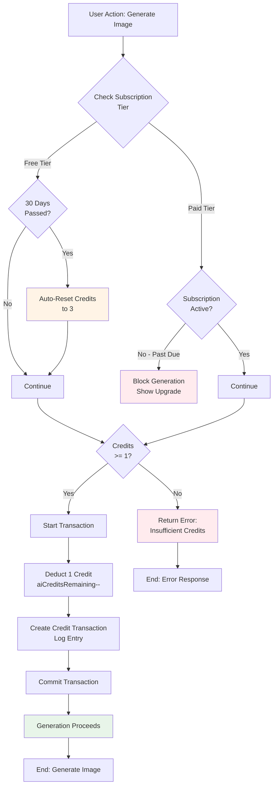

---

## 7. Watermarking Flow

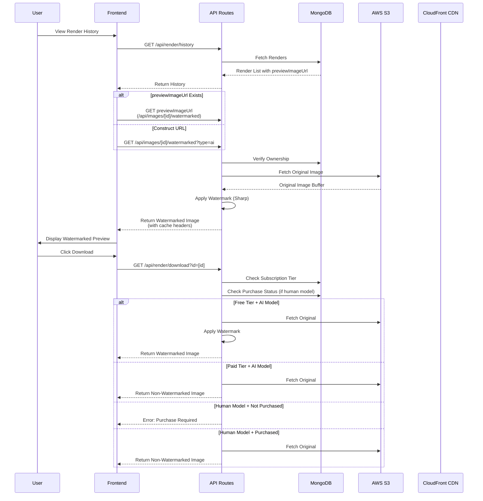

---

## 8. Webhook Processing Flow

```mermaid
flowchart TD
    START[External Service Event]
    
    START --> CLERK_EVENT{Clerk<br/>Event?}
    START --> LEMON_EVENT{Lemon Squeezy<br/>Event?}
    START --> STRIPE_EVENT{Stripe<br/>Event?}
    
    %% Clerk Webhook
    CLERK_EVENT -->|Yes| CLERK_VERIFY[Verify Svix Signature]
    CLERK_VERIFY --> CLERK_TYPE{Event Type}
    CLERK_TYPE -->|user.created| CLERK_CREATE[Create User in MongoDB<br/>Set role: null]
    CLERK_TYPE -->|user.updated| CLERK_UPDATE[Update User Data]
    CLERK_TYPE -->|user.deleted| CLERK_DELETE[Archive User Data]
    
    %% Lemon Squeezy Webhook
    LEMON_EVENT -->|Yes| LEMON_VERIFY[Verify HMAC Signature]
    LEMON_VERIFY --> LEMON_TYPE{Event Type}
    LEMON_TYPE -->|subscription_created| LEMON_SUB_CREATE[Create Subscription<br/>Allocate Credits]
    LEMON_TYPE -->|subscription_payment_success| LEMON_RENEWAL[Reset Credits<br/>Create Invoice]
    LEMON_TYPE -->|subscription_updated| LEMON_UPDATE[Update Plan<br/>Adjust Credits]
    LEMON_TYPE -->|subscription_cancelled| LEMON_CANCEL[Downgrade to Free<br/>Set Credits to 3]
    LEMON_TYPE -->|order_created| LEMON_ORDER[Process One-time Payment<br/>(Model Purchase)]
    
    %% Stripe Webhook (if used)
    STRIPE_EVENT -->|Yes| STRIPE_VERIFY[Verify Stripe Signature]
    STRIPE_VERIFY --> STRIPE_TYPE{Event Type}
    STRIPE_TYPE -->|checkout.session.completed| STRIPE_CHECKOUT[Process Checkout]
    STRIPE_TYPE -->|invoice.paid| STRIPE_INVOICE[Process Invoice]
    
    %% All paths converge
    CLERK_CREATE --> SAVE[Save to MongoDB]
    CLERK_UPDATE --> SAVE
    CLERK_DELETE --> SAVE
    LEMON_SUB_CREATE --> SAVE
    LEMON_RENEWAL --> SAVE
    LEMON_UPDATE --> SAVE
    LEMON_CANCEL --> SAVE
    LEMON_ORDER --> SAVE
    STRIPE_CHECKOUT --> SAVE
    STRIPE_INVOICE --> SAVE
    
    SAVE --> EMAIL[Send Email Notification]
    EMAIL --> END[End: Webhook Processed]
    
    style CLERK_VERIFY fill:#e3f2fd
    style LEMON_VERIFY fill:#fff3e0
    style STRIPE_VERIFY fill:#f3e5f5
    style SAVE fill:#e8f5e9
```

---

## 9. Free Tier Credit Reset Flow (Cron Job)

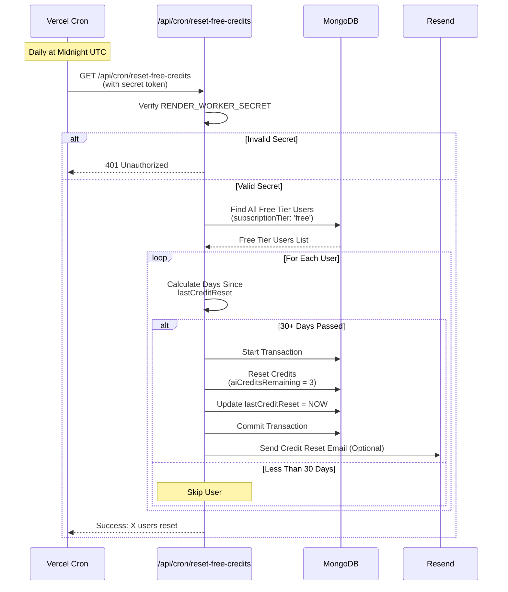

---

## 10. Complete User Onboarding Flow

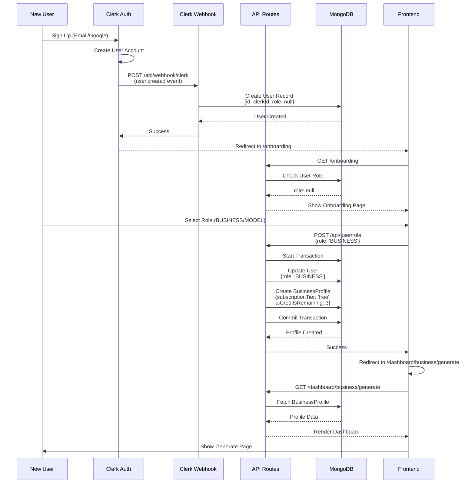

---

## 11. Model Earnings & Payout Flow

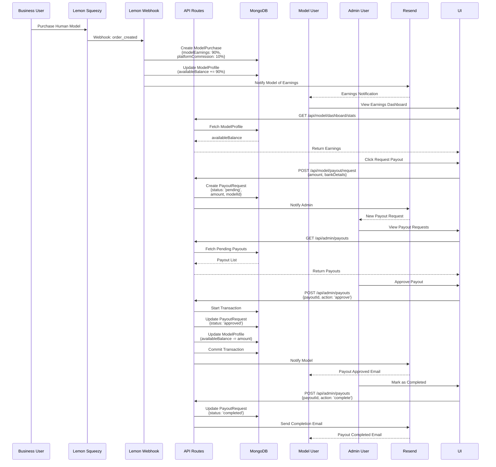

---

## 12. Batch Rendering Flow

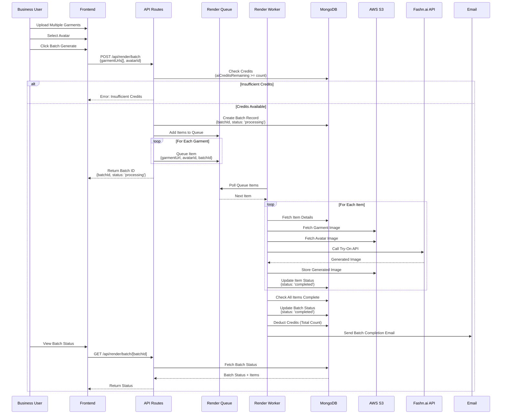

---

## Data Flow Summary

### Key Data Flows:

1. **Image Upload Flow:** Client → API → S3 (Pre-signed URL) → Direct Upload
2. **Render Generation Flow:** Client → API → Credit Check → Fashn.ai → S3 → DB Update
3. **Payment Flow:** Client → API → Lemon Squeezy → Webhook → DB Update → Email
4. **Consent Flow:** Business → API → DB → Email → Model → API → DB Update
5. **Watermarking Flow:** Client → API → S3 Fetch → Apply Watermark → Return
6. **Credit Reset Flow:** Cron → API → DB Query → DB Update → Email (optional)

### Data Storage Locations:

- **MongoDB:** User data, profiles, renders, generations, consent, invoices, purchases, transactions
- **AWS S3:** All images (garments, generated, model references, avatars)
- **CloudFront CDN:** Cached images for fast delivery

### Critical Transactions:

- Credit deduction (atomic)
- Subscription updates (atomic)
- Model purchase processing (atomic)
- Consent approval (atomic)
- Payout processing (atomic)

---

**Last Updated:** January 18, 2026
