# ModelSnap User Flow Diagrams (Business & Model)

Below are the full user flow diagrams in Markdown format, covering both roles:
- **Business Flow** (AI Avatar & Human Model usage)
- **Model Flow** (consent, approvals, royalties)

All flows respect the rule:
> **A business must request consent once per model. After approval, the business can use the human model anytime.**

---

# 🧩 **Business User Flow**

## **1. Signup & Setup**
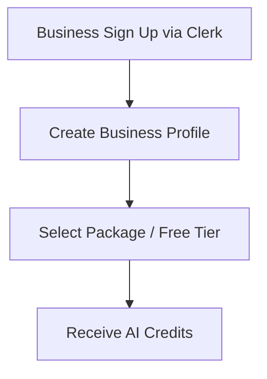

---

## **2. Choose Image Creation Path**
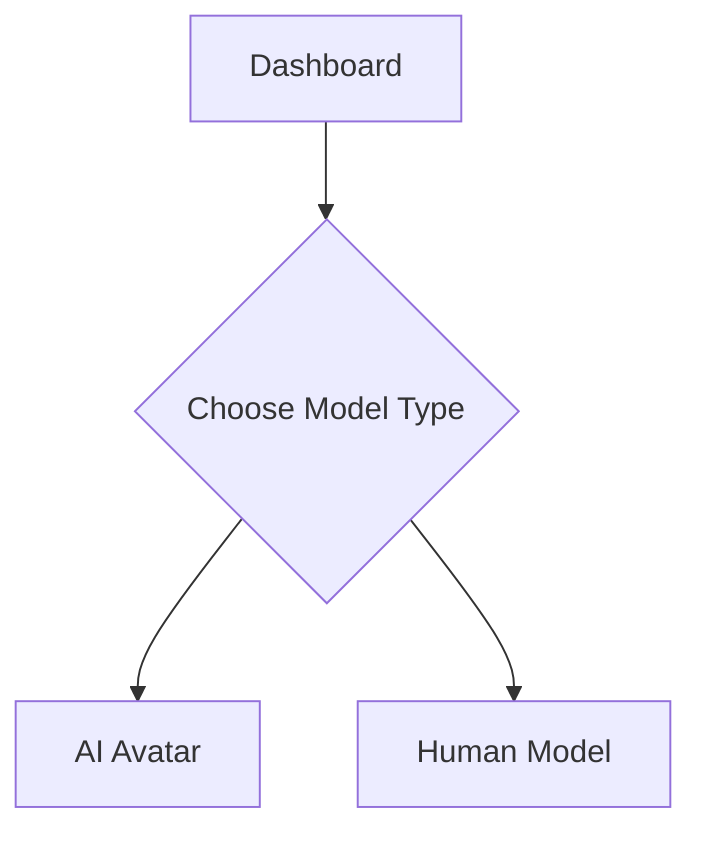

---

## **3A. AI Avatar Workflow**
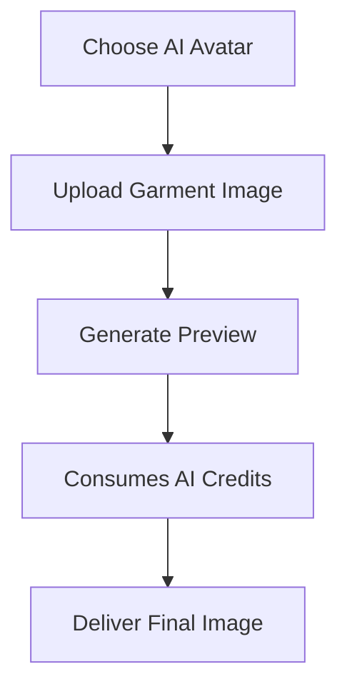

---

## **3B. Human Model Workflow**

### **Step 1 — Model Browsing**
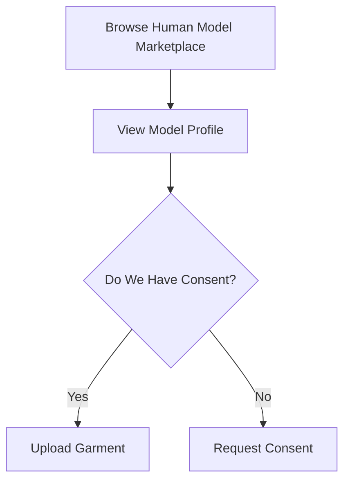

### **Step 2 — Consent Request**
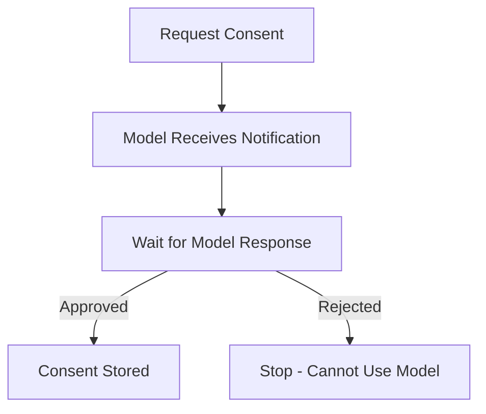

### **Step 3 — Post-Consent Flow**
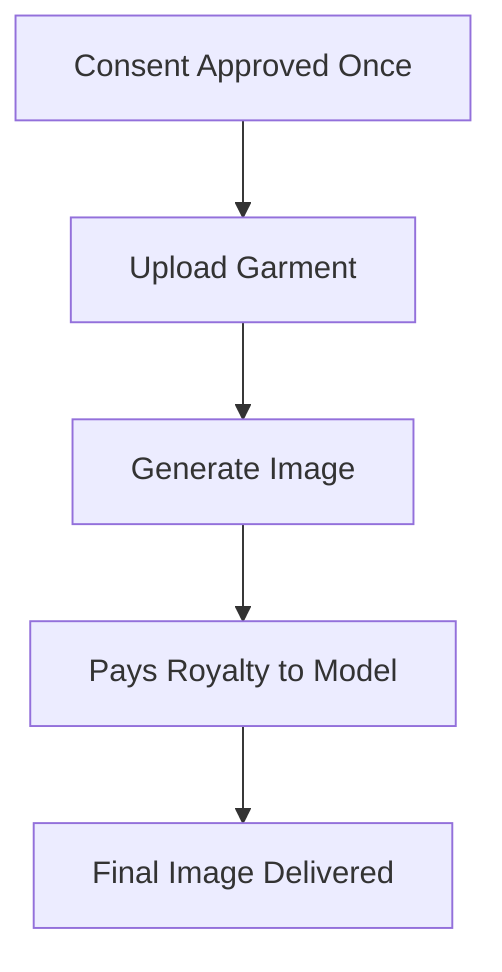

> **Consent is one-time per business per model.** After that, the business can continue using the model without asking again.

---

# 🧩 **Model User Flow**

## **1. Signup & Profile Creation**
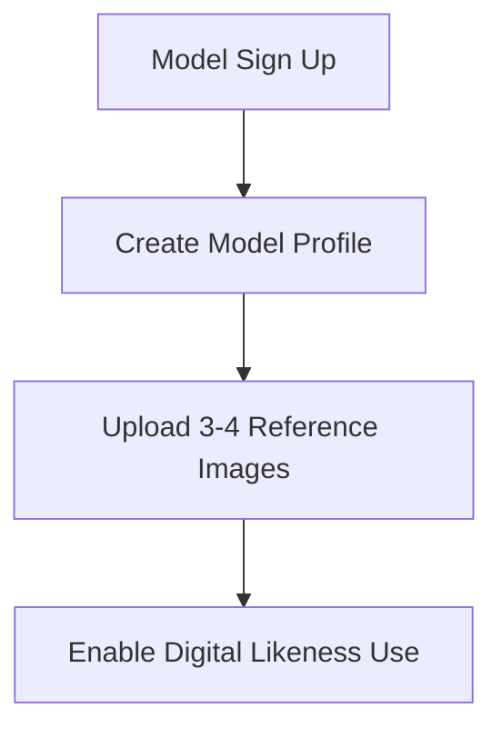

---

## **2. Receiving Consent Requests**
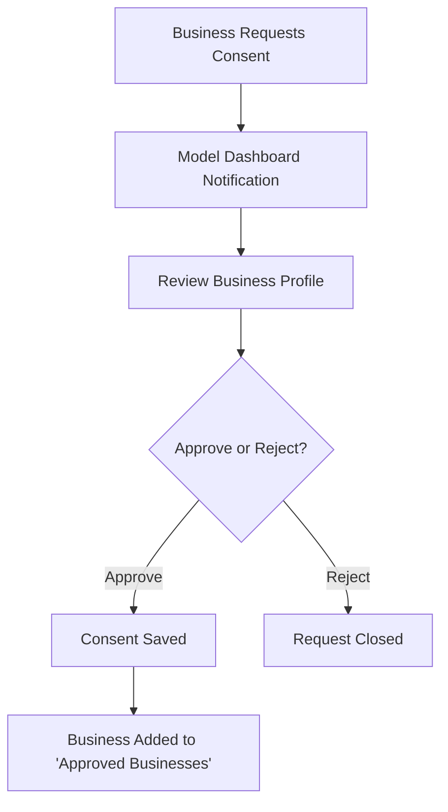

---

## **3. Human Model Usage → Earning Royalties**
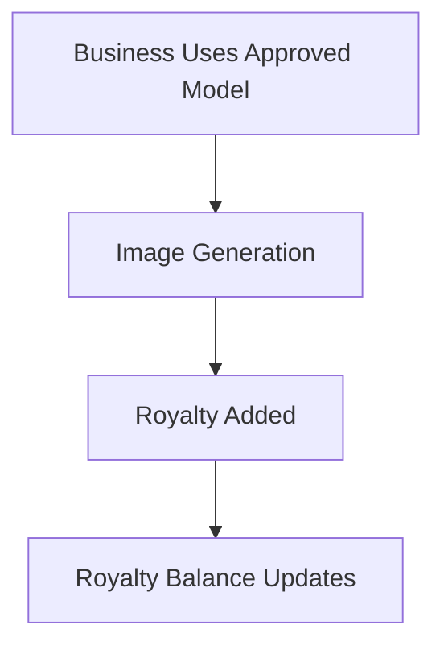

---

## **4. Payout Flow**
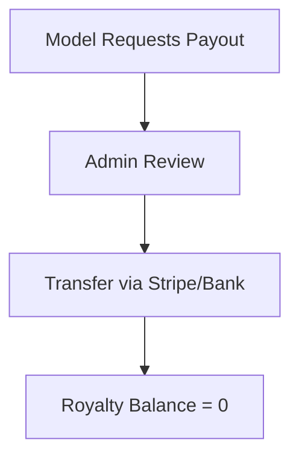

---

# ✅ Summary
This diagram set maps the entire ecosystem:
- Business onboarding → choosing between AI avatar or human model
- Automatic logic for consent checks
- One-time consent rule
- Royalty flow for human models
- Model approval, balance management, and payout

If you want, I can now generate **system sequence diagrams**, **API workflow diagrams**, or a **full architecture diagram** in Markdown + Mermaid.

## API Sequence Diagrams

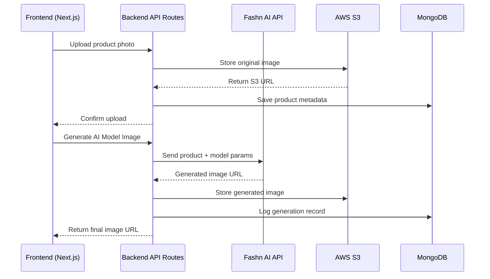

---

## System Architecture Diagram

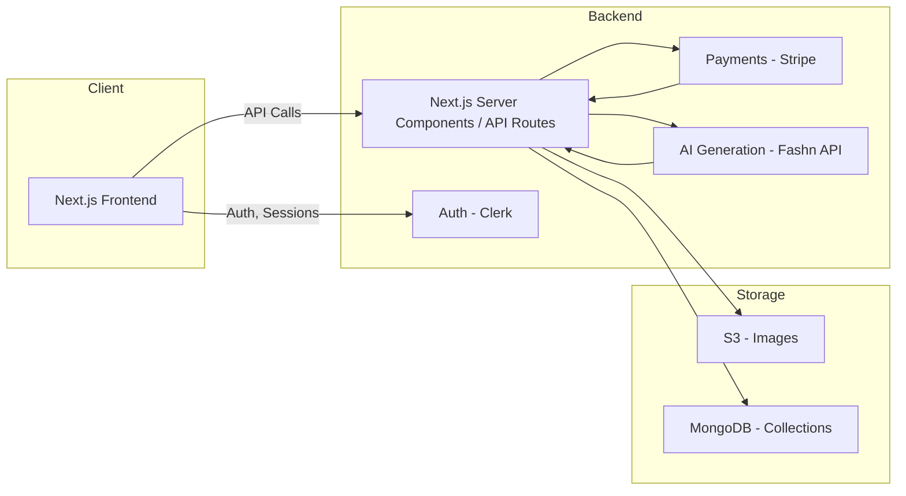

---

## Frontend Component & Route Flow

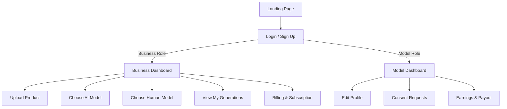

---

## Consent Logic State Machine

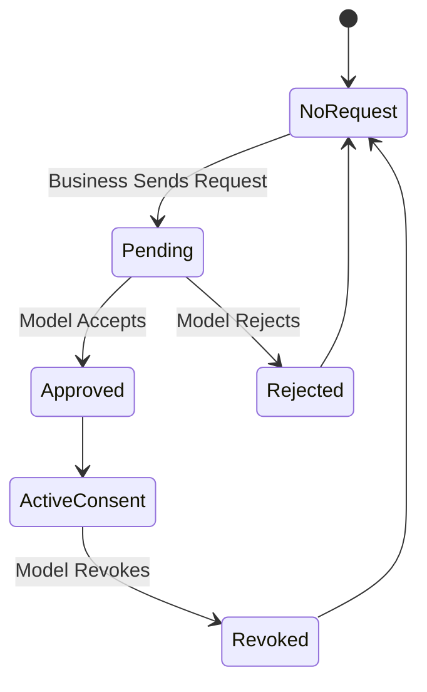

---

## Credit Usage Flow Diagram

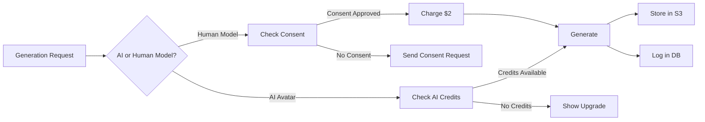

